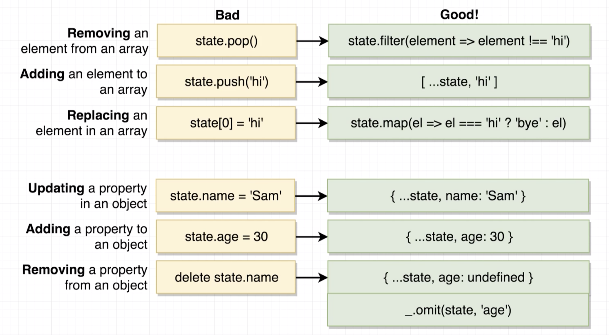

# Think react and redux again

### Learning Points

- Components (i.e., `componentDidMount()`) are generally responsible for fetching data they need by calling an action creator.

- Action creators initiate the data fetching process (i.e., making an API call). Redux-thunk helps us handle asynchronous action creators.

- Fetched data are sent into a component, and a new state is generated in the redux store. The `connect` function receives `mapStateToProps` as the first argument, making the state available to the component as its props.

- Don't use a traditional approach to making an API call directly inside an action creator (by creating an instance of an axios client and using async-await syntax to fetch data). Otherwise, the following error will be returned:

  ```
  Error: Actions must be plain objects. Use custom middleware for async actions.
  ```

- When an action creator is passed into a connect function, React-Redux (RR) takes it and wraps it up, so any time the action creator gets called and returns an action, RR is going to forward it to the `dispatch` function behind the scenes like so:

  ```js
  store.dispatch(
    someActionCreator();
  );
  ```

- A middleware is essentially a JS function that gets called with every action that is dispatched. It can stop or modify this action. React-redux dispatches an action to middlewares first, then to reducers.

- `redux-thunk` (RT) is a middleware that changes the behavior of a redux store slightly. RT relaxes the rule of action creators, in that it allows them to return a function (in addition to a plain object). Additionally, RT automatically invokes the function (RT receives dispatch and getState as its arguments). Once the request is complete, then RT manually dispatches the action, which is then handed off to all the reducers.

  ```js
  // this action creator returns a function
  export const fetchPosts = () => async (dispatch) => {
    const response = await jsonPlaceholder.get("/posts");

    dispatch({ type: "FETCH_POSTS", payload: response });
  };
  ```

- Common patterns around reducers

  ```js
  export default (state = [], action) => {
    switch (action.type) {
      case "FETCH_USER":
        return [...state, action.payload];
      default:
        return state;
    }
  };
  ```

- Some rules around Reducers

  - Reducers cannot return `undefined`. They must **return** some type of values.

  ```js
  // not allowed
  export default combineReducers({});

  // allowed
  export default combineReducers({
    posts: PostsReducer,
  });
  ```

  - Reducers produce 'state', or data to be used inside of the app, using only previous state and the action.
  - Reducers are pure.
  - Reducers must not mutate its input `state` argument. Instead, work with new arrays and objects. Refer to the illustration below (sourced from React tutorials by Stephen Grider).

  

- There are two ways to avoid making duplicate requests (i.e., "overfetching").

  1. Memoize functions.

  ```js
  export const fetchUser = (id) => (dispatch) => _fetchUser(id, dispatch);

  // can make a single request only with a given argument
  const _fetchUser = _.memoize(async (id, dispatch) => {
    const response = await jsonPlaceholder.get(`/users/${id}`);

    dispatch({ type: "FETCH_USER", payload: response.data });
  });
  ```

  2. Combine unit action creators into a new action creator, which manually dispatches the result of calling each unit action creators (i.e., the result being a function, which is picked up by `redux-thunk`).

  - Use lodash library to chain functions and improve readability:

  ```js
  _.chain(getState().posts)
    .map("userId")
    .uniq()
    .forEach((id) => dispatch(fetchUser(id)))
    .value();
  ```

### References

- Tutorials from [here](https://www.udemy.com/course/react-redux/).
